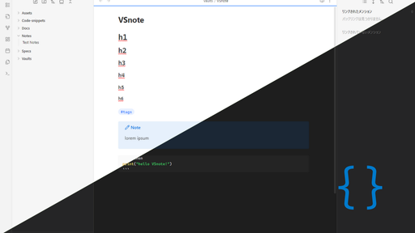
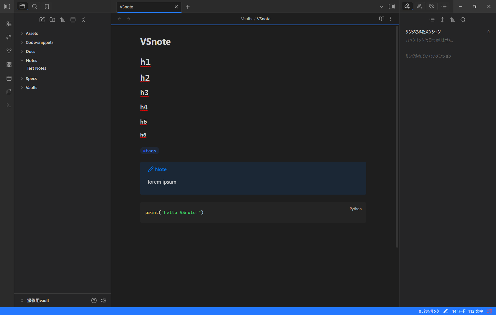
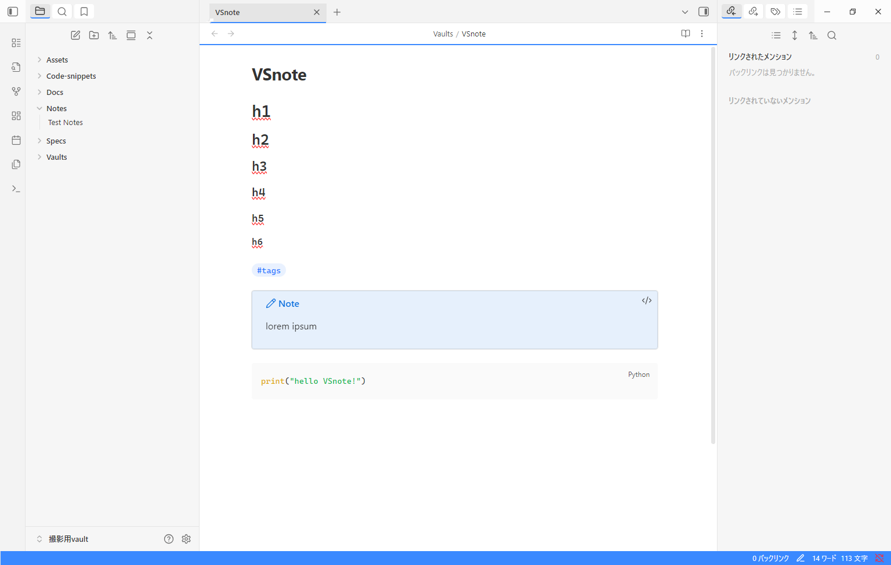

# VSNote — A Visual Studio Dark replica for Obsidian

> Bring your coding environment into your second brain.

## Why VSNote?

If you live in VS Code all day, switching to Obsidian can feel like a visual shock.  
VSNote smooths the transition by making your notes look and feel like home.

> **Disclaimer:** This is an **unofficial** Obsidian theme inspired by Visual Studio Code.  
> It is not affiliated with or endorsed by Microsoft or the Visual Studio Code team.

## Overview

VSNote brings the familiar look and feel of Visual Studio Code into Obsidian,  
combining the productivity of your favorite editor with the note-taking power of Obsidian.

### Features

- **VS Code-inspired color palette** for both Light and Dark modes.
- **Monospaced headings** for a developer-friendly look.
- **Active tab underline** just like VS Code’s tab bar.
- **VS Code-style status bar** spanning the entire bottom edge.
- Folder/file tree and icon tweaks to resemble the VS Code explorer.
- Accent color customization via `--interactive-accent`.

### Limitations
- Full reproduction of VS Code's square scrollbars is not possible due to Obsidian's reliance on native system scrollbars.  
- This theme provides similar colors and overall feel, but scrollbar appearance may vary depending on your operating system.
- Certain plugins (e.g. Novel Word Count in “below” mode) may cause layout overlap in the file explorer due to additional elements under filenames.

### Notes

- Accent color defaults to Obsidian’s standard purple.  
  If you want the **VS Code blue** look, change your accent color in **Settings → Appearance → Accent color**  
  and set the RGB values to:  
  - HEX: `#007acc`
  - RGB: (0, 122, 204)
- The theme is designed for Obsidian’s built-in theme installer (“Community Themes”) —  
  no manual installation instructions are provided here.
- Works best with the default Obsidian UI layout.  
  Some heavily customized plugin layouts may need additional CSS adjustments.

### Customization

This theme uses Obsidian's built-in accent color system.  
Scrollbar colors and highlights follow the accent color you select in **Settings → Appearance → Accent color**.  
Direct CSS editing is not required or recommended.

### Screenshots

#### Dark Mode

#### Light Mode

### 🚧 Future Works

- Integration with **Style Settings** for easy customization
- Additional color schemes (Quiet Light, Solarized, etc.)
- Further UI refinements to improve Visual Studio Code fidelity
- Support for popular Obsidian plugins to match VS Code aesthetics
- Add a Style Settings option to enable “extra padding in file explorer” for plugins that insert content below filenames (to prevent layout collapse).

### 📜 License

This theme is released under the [MIT License](License.txt).
Visual Studio Code is a trademark of Microsoft.
This project is not affiliated with, endorsed by, or sponsored by Microsoft in any way.

---

Install it. Write like you’re coding.  
VSNote is your dev brain's happy place.
Happy noting! 🚀
